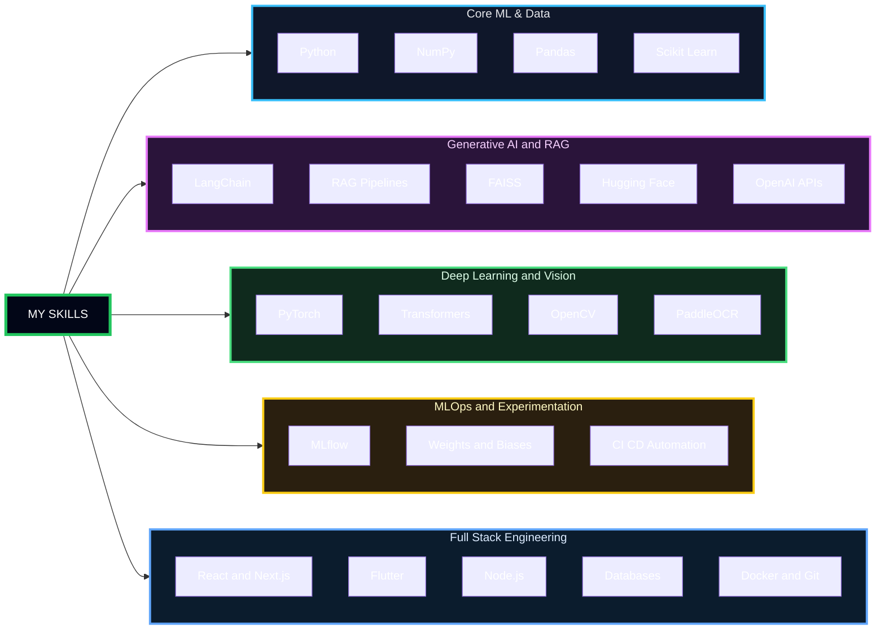

Metrics branch

##  About Me

I am an **Applied Machine Learning Engineer** specializing in the development and deployment of **Large Language Models (LLMs)** and **Computer Vision** systems. My work is focused on architecting **production-ready, scalable solutions** across the Health-Tech and Ed-Tech verticals.

I prioritize moving models from research to deployment, designing for **data-driven impact** and **system reliability**. I am proficient in the full lifecycle of an AI product:

* **Model Engineering:** Designing and evaluating generative AI/RAG architectures.
* **System Design:** Building robust, containerized backends for low-latency API serving.
* **Cross-Platform Deployment:** Leveraging frameworks like **Flutter** to deliver intelligent solutions directly to end-users.

---

##  What I'm Building

## Dabba AI Ecosystem: A Technical Deep Dive
Project Title: Contextual RAG System for Enterprise Knowledge Retrieval

This is my flagship project: an end-to-end Retrieval-Augmented Generation (RAG) platform designed to solve the context and privacy challenges of generalized LLMs within educational institutions. It transforms vast, unstructured academic data (syllabi, policies, Q-papers) into a highly accurate, private, and interactive knowledge retrieval system.

The system is engineered as a microservice architecture built for scalability and low-latency querying

##  My Core Technical Competencies

I maintain a versatile stack to manage the entire AI product lifecycle, from model training and deployment to full-stack application development.

###  Applied Machine Learning & Generative AI 

| Core ML & Data | RAG & Orchestration | Deep Learning & Vision | MLOps & Experimentation |
| :--- | :--- | :--- | :--- |
|  |  |  |  |
|  |  |  |  |
|  |  |  |  |
|  |  |  | |
| |  | | |

 

###  Software Engineering & Deployment 

| Cloud & Containerization | Frontend & Mobile | Backend & Databases | Other Languages |
| :--- | :--- | :--- | :--- |
|  |  |  |  |
|  |  |  |  |
| |  |  | |
| |  |  | |
| *Core Web:*   | | *Data Tools:*  | |

##  Let's Connect

I'm always open to collaborating on interesting projects or discussing new ideas. Feel free to reach out!

  
  

---

## ❤️ Support My Work

---

##  Fuel the Mission

I’m building India’s next-gen AI + IoT innovations —  
from SmartSant IoT (AI disease prediction) to Dabba AI (self-learning university AI ecosystem).

If you believe in the vision, support the journey.

### **💖 Become a Sponsor**

---

---

  

