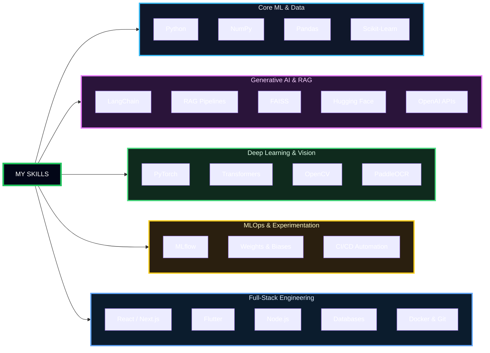

---

## About Me

B.Tech CSE student at **Brainware University, Kolkata** (graduating 2027) with a published **IEEE 2026** paper on intelligent scheduling for IoMT systems (**NAPSO framework** — Neutrosophic-Aware Priority Scheduling, Samsung Innovation Campus). I build AI systems that go beyond notebooks: RAG pipelines for institutional knowledge retrieval, low-cost IoT health screening for real-world deployment, and cross-platform apps that put ML directly in users' hands.

My focus areas: **LLMs & RAG**, **Computer Vision**, **Healthcare IoT**, and the infrastructure to take models from research to production.

---

## What I'm Building

###  Dabba AI — Contextual RAG for Universities

An end-to-end Retrieval-Augmented Generation platform designed to solve the context and privacy limitations of generic LLMs in educational institutions. It ingests unstructured academic data — syllabi, policies, past question papers — and exposes a low-latency, highly accurate, private knowledge retrieval API.

**Architecture highlights:**
- Microservice design with containerized FastAPI endpoints
- Dense vector retrieval via **FAISS** + hybrid re-ranking
- Document pipeline: OCR (PaddleOCR) → chunking → embedding → indexing
- LangChain orchestration with context-aware prompt templates
- Flutter frontend for cross-platform student access

**Stack:** Python · LangChain · FAISS · HuggingFace · PaddleOCR · FastAPI · Docker · Flutter

---

###  SmartSant IoT — AI Health Screening in Sanitation Infrastructure

A low-cost AI + IoT health screening system embedded in everyday sanitation infrastructure, built for Samsung Solve for Tomorrow 2026 (Theme: Accessible Healthcare, ages 14–22). The core insight: sanitation touchpoints are the one health interaction point that reaches every demographic, every day.

**Technical approach:**
- Edge-deployed inference on microcontroller-grade hardware
- Anomaly detection for early disease indicators via sensor fusion
- Fog computing layer to aggregate and pre-process data before cloud sync
- Designed for sub-₹500 BOM cost per unit for real-world scale

**Stack:** Python · TensorFlow Lite · MQTT · Edge MCUs · Firebase

## My Stack

```mermaid
flowchart LR
    A[MY SKILLS]:::root

    subgraph B[Core ML & Data]
        B1[Python]
        B2[NumPy]
        B3[Pandas]
        B4[Scikit-Learn]
    end

    subgraph C[Generative AI & RAG]
        C1[LangChain]
        C2[RAG Pipelines]
        C3[FAISS]
        C4[Hugging Face]
        C5[OpenAI APIs]
    end

    subgraph D[Deep Learning & Vision]
        D1[PyTorch]
        D2[Transformers]
        D3[OpenCV]
        D4[PaddleOCR]
    end

    subgraph E[MLOps & Experimentation]
        E1[MLflow]
        E2[Weights & Biases]
        E3[CI/CD Automation]
    end

    subgraph F[Full-Stack Engineering]
        F1[React / Next.js]
        F2[Flutter]
        F3[Node.js]
        F4[Databases]
        F5[Docker & Git]
    end

    A --> B
    A --> C
    A --> D
    A --> E
    A --> F

    classDef root fill:#020617,color:#ffffff,stroke:#22c55e,stroke-width:4px;
    style B fill:#0f172a,stroke:#38bdf8,stroke-width:3px,color:#e5e7eb
    style C fill:#2a143a,stroke:#e879f9,stroke-width:3px,color:#f5d0fe
    style D fill:#0f2a1d,stroke:#4ade80,stroke-width:3px,color:#dcfce7
    style E fill:#2a1f0f,stroke:#facc15,stroke-width:3px,color:#fef9c3
    style F fill:#0b1c2d,stroke:#60a5fa,stroke-width:3px,color:#dbeafe
```

| Domain | Tools |
| :--- | :--- |
| **Core ML** | Python, NumPy, Pandas, Scikit-Learn |
| **Generative AI & RAG** | LangChain, FAISS, HuggingFace, OpenAI APIs |
| **Deep Learning & Vision** | PyTorch, Transformers, OpenCV, PaddleOCR |
| **MLOps** | MLflow, Weights & Biases, CI/CD, Docker |
| **Full-Stack** | React, Next.js, Node.js, Flutter, Firebase, Supabase, MySQL |
| **Languages** | Python, JavaScript/TypeScript, Dart, Java |

---

## GitHub Stats

  
  

  

---

## Let's Connect

Open to collaborations in AI/ML, healthcare IoT, and edtech. Reach out anytime.

  
  

---

## Support the Work

I'm building AI systems for real-world problems in healthcare and education — from NAPSO's IoMT scheduling research to SmartSant's field-deployable health screening. If the work resonates, sponsorship helps keep it going.

---

  

