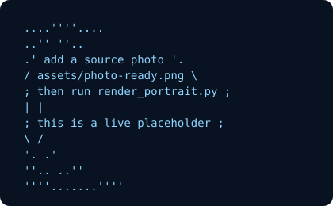

<div align="center">
  <h3><code>$ cat contributions.log</code></h3>
  
  <br><br>
  <h3><code>$ whoami --verbose</code></h3>
  <table>
    <tr>
      <td valign="top"></td>
      <td valign="top"></td>
    </tr>
  </table>
</div>

## Build / refresh locally

```bash
python -m venv .venv && source .venv/bin/activate
pip install -r tools/requirements-daily.txt
python tools/pull_contributions.py --username chandril-mallick
python tools/render_graph.py
python tools/render_panel.py
```

## Rebuild portrait from a photo

```bash
pip install -r tools/requirements-art.txt
python tools/clean_photo.py assets/input-photo.jpg
python tools/render_portrait.py
```

## Notes

1. The profile graph is regenerated daily by `.github/workflows/refresh-graph.yml`.
2. Set `PREVIEW=1` when running `tools/render_panel.py` or `tools/render_graph.py` to render static (non-animated) previews.
3. By default, scripts read `GITHUB_USERNAME` from env and fall back to `chandril-mallick`.
4. GitHub's public contributions endpoint currently exposes daily heatmap levels, not raw per-day counts; this setup uses exact yearly total + daily level data.
